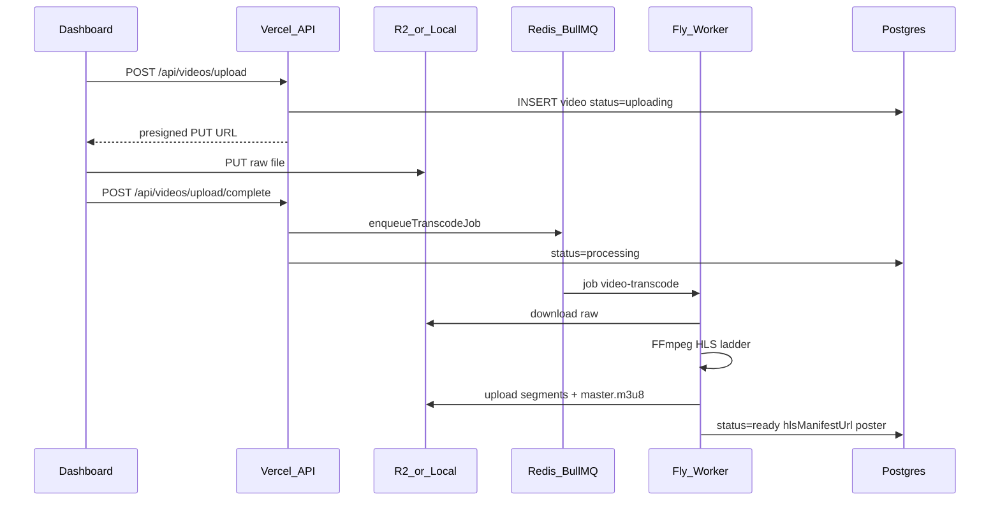

# FrameVid — System Design

Canonical architecture for the FrameVid monorepo: how the platform works **today**, and the **planned** Deepgram + OpenAI enrichment pipeline on the existing BullMQ stack.

Related docs: [README.md](README.md) (local dev) · [DEPLOY.md](DEPLOY.md) (production) · [Agent.md](Agent.md) (coding rules) · [prd.md](prd.md) (product) · [status.md](status.md) (build progress)

---

## Introduction

FrameVid is video hosting and delivery built for **Framer designers**. Designers upload in the **dashboard**; published Framer sites play video through a **native Framer code component** (`FrameVidPlayer`), not an iframe embed.

**Stack (current):** Next.js 14 dashboard on Vercel · BullMQ + FFmpeg worker on Fly.io · Postgres (Drizzle) · Redis (Upstash/local) · Cloudflare R2 · HLS via hls.js.

**Explicit non-goals (current):** Upstash Workflow orchestration · iframe `/embed/[id]` routes · Redis cache for player metadata (meta is read from Postgres on each request).

---

# Part I — Current architecture

## 1. Deployment topology

| Service | Platform | Package / path |
|---------|----------|----------------|
| Dashboard + HTTP API | **Vercel** | `apps/dashboard` (monorepo root: `apps/dashboard`) |
| Transcoding worker | **Fly.io** | `apps/worker` (`Dockerfile.worker`) |
| Relational data | **Postgres** (Supabase / Neon) | `packages/db` |
| Job queue | **Redis** (Upstash in prod) | `packages/queue` + BullMQ |
| Object storage | **Cloudflare R2** | Presign from dashboard; upload from worker |
| CDN | R2 public URL | `cdn.framevid.co` (or dev `/api/media` proxy) |

**Production dashboard (example):** `https://dashboard-alpha-kohl-78.vercel.app`  
**Framer API base (prod):** `https://dashboard-alpha-kohl-78.vercel.app/api/v1`  
**Local Framer dev:** `http://localhost:3000/api/v1`

```
┌─────────────────────┐     ┌──────────────┐     ┌─────────────────┐
│ Vercel              │     │ Redis        │     │ Fly.io          │
│ apps/dashboard      │────▶│ BullMQ       │◀────│ apps/worker     │
│ Next.js + /api/*    │     │ video-transcode     │ FFmpeg + R2 I/O │
└──────────┬──────────┘     └──────────────┘     └────────┬────────┘
           │                                                 │
           ▼                                                 ▼
┌─────────────────────┐                          ┌─────────────────┐
│ Postgres            │                          │ Cloudflare R2   │
│ users, videos, …    │                          │ raw + HLS + assets │
└─────────────────────┘                          └─────────────────┘
```

---

## 2. Monorepo structure

```
framevid/
├── apps/
│   ├── dashboard/          # Designer UI + all API routes (App Router)
│   ├── component/          # Framer Marketplace player (FrameVidPlayer)
│   └── worker/             # BullMQ consumer + FFmpeg (entry: src/processor.ts)
├── packages/
│   ├── db/                 # Drizzle schema + migrations
│   ├── types/              # Shared TypeScript types (Video, VideoSettings, …)
│   ├── queue/              # enqueueTranscodeJob, TRANSCODE_QUEUE_NAME
│   └── config/             # Shared TS config
├── SYSTEMDESIGN.md         # This file
├── DEPLOY.md
├── Agent.md
├── prd.md
└── status.md
```

| App / package | Responsibility |
|---------------|----------------|
| `apps/dashboard` | Pages: `/`, `/signin`, `/signup`, `/videos/[videoId]`, `/settings/*`. All `/api/*` handlers. |
| `apps/component` | `FrameVidPlayer.tsx` — HLS, motion, CTAs, forms, analytics beacon. |
| `apps/worker` | Consumes `video-transcode` jobs; downloads raw, runs FFmpeg, uploads HLS to R2. |
| `packages/db` | Schema in `schema.ts`; migration `drizzle/0000_init.sql`. |
| `packages/queue` | `TranscodeJobData`: `videoId`, `workspaceId`, `rawKey`, `originalFilename`. |

**Worker entry point:** `apps/worker/src/processor.ts` (not separate `queue.ts` / `captions.ts` files).

---

## 3. Data model and storage

### 3.1 Postgres (Drizzle)

| Table | Purpose |
|-------|---------|
| `users` | Email, password hash (custom auth), profile |
| `workspaces` | Tenant, plan, storage/bandwidth counters |
| `workspace_members` | Roles: admin / editor / viewer (invites not fully built) |
| `videos` | Title, status, HLS URL, poster, **captionsUrl**, **settings** JSONB |
| `folders` / `video_folders` | Library organization |
| `video_events` | Analytics events (Postgres today; ClickHouse planned per PRD) |
| `leads` | Gated form submissions with dedupe key |

**`videos.status`:** `uploading` → `processing` → `ready` | `error`

**`videos.settings`:** Player customization — colors, controls, CTAs, lead-capture form, play button, motion flags. Typed as `VideoSettings` in `packages/types`.

### 3.2 R2 object keys (current)

```
{workspaceId}/{videoId}/raw/{filename}
{workspaceId}/{videoId}/transcoded/...       # HLS variants (360p, 720p, 1080p) + master.m3u8
{workspaceId}/{videoId}/poster.jpg
{workspaceId}/{videoId}/captions/captions.vtt
```

Helpers: `apps/dashboard/app/lib/asset-url.ts` (`posterStorageKey`, `captionsStorageKey`, `resolveMediaUrl`).

**Local dev (no R2):** files under `LOCAL_UPLOAD_DIR` (default `.data/uploads`); served via `GET /api/media?key=...`.

### 3.3 Current vs planned schema / storage

| Field / path | Status | Notes |
|--------------|--------|-------|
| `videos.captionsUrl` | **Current** | Manual `.vtt`/`.srt` upload; future auto-fill from Deepgram |
| `videos.aiInsights` | Planned | `jsonb` — summaries, titles, tags |
| `videos.audioExtracted` | Planned | `boolean` — worker ↔ AI handoff |
| `.../transcoded/audio.mp3` | Planned | Compact audio for Deepgram |

---

## 4. Core flows

### 4.1 Upload and transcode



**Key files:**

- `apps/dashboard/app/api/videos/upload/route.ts`
- `apps/dashboard/app/api/videos/upload/complete/route.ts`
- `packages/queue/src/index.ts` — queue name `video-transcode`
- `apps/worker/src/processor.ts` — FFmpeg; simulates Mux test stream if FFmpeg/raw missing

**Note:** There is **no** R2 webhook auto-queue today; the client must call `upload/complete`.

### 4.2 Playback (Framer + dashboard preview)

1. Client calls `GET /api/v1/videos/{videoId}/meta` (alias of dashboard meta route).
2. Response includes `hlsManifestUrl`, `settings`, `posterUrl`, `captionsUrl`, `status`.
3. **Framer component:** dynamic `hls.js` attach; on canvas (`RenderTarget.canvas`) shows static poster only.
4. **Dashboard preview:** same meta + inline `<video>` with custom controls in `VideoDetailsClient.tsx`.

### 4.3 Captions (current — manual upload)

| Step | Implementation |
|------|----------------|
| Upload | `POST /api/videos/[videoId]/captions` — accepts `.vtt` or `.srt` (converted to VTT) |
| Storage | R2 key `.../captions/captions.vtt`; `videos.captionsUrl` updated |
| Remove | `DELETE` same route |
| Dashboard preview | Client fetches VTT, `parseVtt()` overlay **above** custom control bar |
| Framer player | Native `<track kind="captions">` when `captionsUrl` is set |

**Known gap:** Dashboard uses a styled overlay; the component uses browser native captions. Unification is **Milestone 3** (Part II).

### 4.4 Analytics and leads

- **Events:** `POST /api/v1/events` → `video_events` (Postgres). Player uses `sendBeacon` from `FrameVidPlayer`.
- **Leads:** `POST /api/videos/[videoId]/leads` when lead-capture form is enabled in `settings`.
- **Dashboard analytics tab:** retention heatmap, cliff detection, and AI friction insights (authenticated).

### 4.5 Engagement analytics (heartbeat pipeline)

One tracker feeds two read paths — no separate analytics SDK.

```
[ Visitor on Framer site ]
          │
          ▼ (plays video)
[ FrameVidPlayer ]
  - sessionId: UUID per page load (all events)
  - While playing: heartbeat every 5s bucket (deduped per bucket)
  - POST /api/v1/events  { eventType: "heartbeat", eventData: { bucket, currentTime } }
          │
          ▼
[ Postgres: video_events ]
          │
          ├──► GET /api/v1/videos/[id]/meta
          │         popularityCurve: number[]  (0–100 normalized counts per bucket)
          │         └──► Public SVG waveform on timeline hover (Framer component)
          │
          └──► GET /api/videos/[id]/analytics  (authenticated)
                    retention: buckets + retentionPct per 5s
                    friction?: cliff + OpenAI analysis (uses Deepgram transcript)
                    └──► Dashboard retention heatmap + AI alert card
```

**Heartbeat contract**

| Field | Value |
|-------|--------|
| `eventType` | `heartbeat` |
| `sessionId` | `crypto.randomUUID()` once per mount |
| `eventData.bucket` | `Math.floor(currentTime / 5) * 5` (seconds) |
| `eventData.currentTime` | raw seconds for debugging |

Legacy events (`video_play`, `video_pause`, `video_progress` at 25/50/75) remain for compatibility.

**Feature 1 — Popularity graph (public):** Meta route aggregates heartbeat counts by bucket, normalizes to 0–100, returns `popularityCurve`. Component renders inline SVG in a Framer Motion hover overlay above the progress bar.

**Feature 2 — Retention heatmap (private):** Analytics route computes retention % = distinct sessions with heartbeat at bucket ÷ distinct sessions with `video_play`. Detects max drop-off cliff between consecutive buckets. After Deepgram auto-captions (M2), maps cliff timestamp to transcript segment and calls OpenAI `gpt-4o-mini` for friction copy (cached in `aiInsights`).

---

## 5. API surface (summary)

Auth uses a **custom JWT-style session cookie** (`apps/dashboard/app/lib/auth.ts`), not Clerk.

| Group | Routes |
|-------|--------|
| Auth | `POST /api/auth/signup`, `signin`, `signout`; `GET /api/auth/me` |
| Profile / workspace | `GET/PATCH /api/profile`; `GET/POST /api/workspaces` |
| Upload | `POST /api/videos/upload`, `POST /api/videos/upload/complete`, mock destination |
| Video CRUD | `GET/PATCH/DELETE /api/videos/[videoId]` |
| Public player | `GET /api/videos/[videoId]/meta`, `GET /api/v1/videos/[videoId]/meta` |
| Assets | `POST /api/videos/[videoId]/poster`, `poster/frame`; `POST/DELETE .../captions` |
| Engagement | `POST /api/events`, `POST /api/v1/events`; `POST .../leads`; `GET .../analytics` |
| Library | `GET/POST /api/folders`, `GET/POST /api/folders/videos` |
| Dev / ops | `GET /api/media`, `GET /api/health` |

CORS: meta and events routes allow cross-origin access for the Framer player.

---

## 6. Framer player (`apps/component`)

**File:** `apps/component/src/FrameVidPlayer.tsx`

| Concern | Behavior |
|---------|----------|
| Delivery | Native React component with Framer **property controls** — not iframe |
| API | `apiBaseUrl` prop; default `https://api.framevid.co/v1` in `config.ts` |
| Video | HLS-only (hls.js); three rungs transcoded by worker |
| Canvas | Poster image only — no fetch/HLS on design canvas |
| Motion | Framer Motion variants (`effects/variants.ts`) |
| CTAs / forms | Driven by `settings` from meta API |
| Captions | `<track>` when `meta.captionsUrl` present |
| Analytics | Beacon to `/api/v1/events` |

---

## 7. Dashboard video editor

**Route:** `/videos/[videoId]` — `VideoDetailsClient.tsx`

**Sidebar tabs (current):**

| Tab | Purpose |
|-----|---------|
| analytics | View counts / progress (partial) |
| metadata | Title, description |
| thumbnail | Poster upload / frame capture |
| player | Autoplay, loop, muted, aspect |
| controls | Control bar visibility |
| colors | Primary / theme colors |
| play-button | Play button styling |
| cta | Call-to-action overlays (drag position when paused on CTA tab) |
| form | Lead-capture form |
| subtitles | Manual caption upload |
| danger | Delete video |

Settings persist via `PATCH /api/videos/[videoId]` merging into `videos.settings` JSONB.

**Planned tab:** AI Marketing Suite (Part II) — reads/writes `aiInsights`.

---

# Part II — Planned: AI enrichment (Deepgram + OpenAI)

Integrate transcription and marketing insights into the **live monorepo** without replacing BullMQ, Fly.io, or the native Framer component.

**Principle:** No Upstash Workflow. Extend `apps/worker` and add a Vercel webhook route.

---

## 8. Schema and R2 evolution

### 8.1 Schema enhancements (`packages/db/schema.ts`)

Add to existing `videos` table:

| Column | Type | Purpose |
|--------|------|---------|
| `captionsUrl` | `text` | **Exists** — URL/path to compiled `.vtt` |
| `aiInsights` | `jsonb` | **New** — `VideoAiInsights` (summary, title, tags) |
| `audioExtracted` | `boolean` | **New** — worker finished audio extract; AI pipeline can run |

### 8.2 Planned type (`packages/types`)

```ts
export interface VideoAiInsights {
  summary?: string;
  suggestedTitle?: string;
  tags?: string[];
  generatedAt?: string; // ISO timestamp
}
```

### 8.3 Storage path evolution

```
{workspaceId}/{videoId}/raw/{filename}
{workspaceId}/{videoId}/transcoded/...             # Video HLS segments
{workspaceId}/{videoId}/transcoded/audio.mp3       # NEW — compact audio for Deepgram
{workspaceId}/{videoId}/poster.jpg
{workspaceId}/{videoId}/captions/captions.vtt      # Manual upload OR Deepgram output
```

Update worker upload logic and `asset-url.ts` helpers when implementing M1.

---

## 9. Async runtime (BullMQ)

```
                  [ apps/dashboard (Vercel API) ]
                                 │
                     1. POST /upload/complete
                                 │
                                 ▼
                     [ Redis / BullMQ Queue ]
                                 │
                    2. Job: video-transcode
                                 │
                                 ▼
                    [ apps/worker (Fly.io Node) ]
                                 │
         ┌───────────────────────┴───────────────────────┐
         ▼ (Task 1)                                      ▼ (Task 2)
   [ FFmpeg Video Engine ]                         [ FFmpeg Audio Extractor ]
   - Slice HLS segments                            - Output audio.mp3
   - Upload to R2                                 - Upload to R2
         │                                               │
         └───────────────────────┬───────────────────────┘
                                 │
                                 ▼ 3. Fire-and-forget
                     [ Deepgram Listen API (callback) ]
                                 │
                                 ▼ 4. HTTPS webhook
                  [ apps/dashboard /api/v1/webhooks/ai ]
                                 │
                                 ├─► Write captions.vtt → R2
                                 ├─► OpenAI gpt-4o-mini → aiInsights
                                 └─► UPDATE videos (captionsUrl, aiInsights)
```

---

## 10. AI execution lifecycle

### Step 1 — Enhanced FFmpeg (`apps/worker/src/processor.ts`)

When processing a `video-transcode` job, produce HLS **and** a sidecar MP3 in one pass (or a second `ffmpeg` invocation after variants — match existing `runFFmpeg` patterns).

Example dual-output pattern:

```bash
ffmpeg -i input.mp4 \
  -preset superfast -g 48 -sc_threshold 0 \
  -map 0:v -c:v:0 libx264 -b:v:0 2500k -s:v:0 1920x1080 \
  -map 0:v -c:v:1 libx264 -b:v:1 1200k -s:v:1 1280x720 \
  -map 0:a -c:a:0 aac -b:a:0 128k \
  -f hls -hls_time 6 -hls_playlist_type vod \
  -hls_segment_filename "transcoded/%v/seg_%03d.ts" \
  transcoded/master.m3u8 \
  -map 0:a -c:a libmp3lame -b:a 64k transcoded/audio.mp3
```

The MP3 keeps Deepgram ingress small versus shipping full video.

After R2 upload: set `audioExtracted = true` on the video row.

### Step 2 — Fire-and-forget Deepgram handoff

After worker uploads `audio.mp3`, call Deepgram **without blocking** the BullMQ job:

```ts
// apps/worker/src/processor.ts (after R2 upload)
const audioUrl = `${process.env.CLOUDFLARE_R2_PUBLIC_URL}/${workspaceId}/${videoId}/transcoded/audio.mp3`;
const callbackUrl = `${process.env.DASHBOARD_PUBLIC_URL}/api/v1/webhooks/ai?videoId=${videoId}`;

await fetch('https://api.deepgram.com/v1/listen?model=nova-2&smart_format=true&utterances=true', {
  method: 'POST',
  headers: {
    Authorization: `Token ${process.env.DEEPGRAM_API_KEY}`,
    'Content-Type': 'application/json',
  },
  body: JSON.stringify({ url: audioUrl, callback: callbackUrl }),
});
// Worker completes BullMQ job immediately
```

**Env vars:** `DEEPGRAM_API_KEY`, `DASHBOARD_PUBLIC_URL`, `CLOUDFLARE_R2_PUBLIC_URL`.

Use Deepgram's **callback** so transcription does not hold the Fly worker.

### Step 3 — Webhook (`apps/dashboard/app/api/v1/webhooks/ai/route.ts`)

New route (not implemented yet):

1. **Verify** Deepgram callback signature (required for production).
2. **Format captions:** Map utterances → WebVTT; upload to `{workspaceId}/{videoId}/captions/captions.vtt`.
3. **Generate insights:** Send transcript text to OpenAI `gpt-4o-mini` for summary, title suggestions, SEO tags → `aiInsights` JSON.
4. **Update database:** `captionsUrl`, `aiInsights`; optionally notify UI.

**Video status policy (recommended):**

- Transcode completion sets `status = ready` and `hlsManifestUrl` (playback works immediately).
- Captions and insights arrive **asynchronously**; UI shows “Generating captions…” when `audioExtracted && !captionsUrl`.
- Do **not** block `ready` on AI completion.

**Relationship to manual captions:** Auto-generated VTT writes the same `captionsUrl` column. Users can re-upload via existing `POST .../captions` to override.

---

## 11. Product surfaces

### A. Dashboard — AI Marketing Suite tab (planned)

On `/videos/[videoId]`, add a tab alongside existing settings:

- Display `aiInsights` (summary, suggested title, tags).
- Allow edit + save via existing `PATCH /api/videos/[videoId]` (extend payload to accept `aiInsights` or store inside `settings` until schema migration).

### B. Framer player — native captions (partial today)

1. **Read config:** `GET /api/v1/videos/[videoId]/meta` → `captionsUrl`.
2. **Mount track:**

```tsx
<video ref={videoRef}>
  {meta.captionsUrl && (
    <track kind="captions" src={meta.captionsUrl} srcLang="en" label="English" default />
  )}
</video>
```

3. **Style:** Native component (no iframe) allows themed caption CSS tied to property controls — align with dashboard overlay in M3.

---

## 12. Milestone matrix

| Milestone | Deliverable | Owner |
|-----------|-------------|-------|
| **M1 — Audio split** | FFmpeg outputs `audio.mp3` to R2; `audioExtracted` column | `apps/worker` |
| **M2 — Callback webhook** | `/api/v1/webhooks/ai` — VTT compile + OpenAI insights | `apps/dashboard` |
| **M3 — Player captions** | Reliable `<track>` + style parity with dashboard | `apps/component` |
| **M4 — GTM** | Plan gating (billing), Framer marketing pages, launch | Product + dashboard |
| **M5 — Heartbeat ingestion** | 5s bucket beacons + `sessionId` on all player events | `apps/component` + types |
| **M6 — Popularity graph** | `popularityCurve` on meta + SVG hover overlay | meta route + component |
| **M7 — Retention heatmap + AI friction** | Authenticated analytics + Recharts + cliff LLM | dashboard (requires M2 transcript) |

Track implementation progress in [status.md](status.md) (Phase 4).

**New environment variables (planned):**

| Variable | Used by |
|----------|---------|
| `DEEPGRAM_API_KEY` | Worker (submit), Dashboard (optional verify) |
| `OPENAI_API_KEY` | Dashboard webhook (insights; not Whisper STT) |
| `DASHBOARD_PUBLIC_URL` | Worker → callback URL |

---

## Documentation map

| Document | Role |
|----------|------|
| **SYSTEMDESIGN.md** | Architecture: current + planned AI |
| [Agent.md](Agent.md) | Agent coding standards (defer topology here) |
| [prd.md](prd.md) | Product requirements |
| [status.md](status.md) | Checkbox build progress |
| [DEPLOY.md](DEPLOY.md) | Vercel / Fly / R2 / env setup |
| [README.md](README.md) | Clone, migrate, `pnpm dev` |

---

## Appendix — Design decisions locked

| Decision | Choice |
|----------|--------|
| Orchestration | **BullMQ** on Redis — not Upstash Workflow |
| Framer delivery | **Native code component** — not iframe embed |
| Video format | **HLS only** (360p / 720p / 1080p + master) |
| Speech-to-text (planned) | **Deepgram** async + webhook |
| Text insights (planned) | **OpenAI** gpt-4o-mini on transcript |
| Analytics (current) | Postgres `video_events` |
| Analytics (future) | ClickHouse per PRD |
