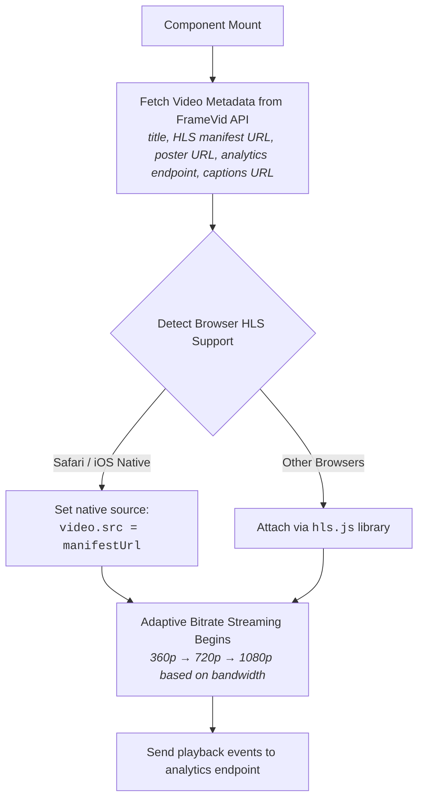

# Product Requirements Document
## FrameVid — Framer Video Platform
**Version 1.0** | *For Internal Agency Use*

***

## 1. Executive Summary

**FrameVid** is a video hosting and delivery platform built exclusively for **Framer** designers. It solves the three core problems every Framer designer hits with video today:
1. **Framer's 5MB upload limit** eats your bandwidth plan.
2. **YouTube embeds** break your design aesthetic.
3. **No existing video tool** feels native to the Framer canvas.

The product is *Vidzflow for Framer*. That analogy is intentional — Vidzflow was developed specifically to address the video challenges Webflow designers face daily, with a focus on seamless integration, professional presentation, and performance, keeping visitors engaged with the site not distracted by external platforms or branding. Nobody has built this for Framer. FrameVid does exactly that. _(Source: Oma-kase)_

> **One line:** Upload once. Drop a component. Your video looks like it was designed in Framer, not dropped into it.

---

## 2. Problem Statement

### 2.1 The Core Pain
* **Bandwidth Overuse:** Framer doesn't transcode or recompress video files at all — it serves them at full resolution regardless of screen size, making video the single biggest cause of bandwidth overuse on any Framer plan. _(Ref: Brixtemplates)_
* **Size Restrictions:** The 5MB upload limit means even a short, high-quality clip breaks things.
* **Aesthetic Degradation:** YouTube embeds work but force YouTube's watermark and controls, which breaks the design aesthetic entirely. _(Ref: we.optimizz)_

Every Framer designer building a product demo, portfolio, background video, testimonial, or case study hits one of these walls on every project.

### 2.2 What Designers Do Today (And Why It Fails)
* **YouTube Embeds:** Free and unlimited, but forces YouTube branding, shows related videos after playback, sends visitors off-site, and adds **400KB+ of JavaScript** to every page load. Unacceptable on a $10K Framer site.
* **Vimeo:** Cleaner player. However, Vimeo was acquired by Bending Spoons in late 2025 and shifted to per-seat pricing, introducing meaningful business risk for growing teams. It is still an iframe — not a Framer component. No motion effects, and no design token inheritance. _(Ref: Checkthat)_
* **Mux / Cloudflare Stream:** Developer tools. API-first, no designer-friendly dashboard, no Framer-native component, and no motion effects library. A Framer designer using Mux is engineering their own solution from scratch on every project.
* **Gumlet:** Best existing option technically. Adaptive streaming, custom branding, and analytics. But it still serves an iframe. No Framer Marketplace component, no motion effects, and not designed by Framer people for Framer people.

> [!IMPORTANT]
> **The Gap:** Nobody has built a video platform where the player is a **real Framer code component** (not an iframe) that inherits design tokens, lives in the properties panel, and has motion effects built-in as Framer Motion variants.

---

## 3. Target Users

* **Primary User — The Framer Designer/Developer:**
  * Agency designer or freelancer building client sites on Framer.
  * Ships 2–10 Framer sites per month.
  * Cares deeply about design quality.
  * Has been burned by YouTube embeds looking unprofessional on a premium client site.
  * Hits Framer's bandwidth limit on any site with video.
  * Will pay $15–$39/month for something that just works and looks good.
* **Secondary User — The Framer Agency:**
  * Agency managing 10–30 client Framer sites.
  * Needs a centralized video library, not per-project chaos.
  * Needs to manage assets across multiple clients without juggling separate accounts.
  * Will pay $79+/month for team access and white-label options.
* **Tertiary User — The Framer Creator:**
  * Portfolio designer, indie founder, creator using Framer for their personal brand or SaaS marketing site.
  * Price-sensitive. Free tier is the entry point.
  * Upgrades when they hit storage or branding limits.

---

## 4. Product Overview

FrameVid has three distinct surfaces:

1. **Surface 1: The Dashboard (Web App at `framevid.co` or similar)**
   * Where designers upload, manage, and configure videos.
   * Clean, minimal UI that feels like a Framer product.
2. **Surface 2: The Framer Component (Published on Framer Marketplace)**
   * The player that lives on the actual site.
   * A real code component (not an iframe).
   * Installed once via Framer Marketplace, reused across every project.
3. **Surface 3: Analytics (Inside the Dashboard)**
   * Per-video performance data — watch time, completion rate, drop-off points, play rate by page.
   * Feeds into the main platform analytics if the designer also uses FrameStack analytics.

---

## 5. Feature Specification

### 5.1 Dashboard — Upload & Management

#### Video Upload
* **Interface:** Drag-and-drop or click-to-upload interface.
* **Supported Formats:** MP4, MOV, WebM, AVI, MKV (all common formats accepted).
* **File Limits:** Maximum upload size of 10GB per file (no practical limit for designers).
* **Direct Uploads:** Presigned URL upload directly to Cloudflare R2 — no server bottleneck; upload speed is limited only by user's connection.
* **UX Indicators:** Upload progress indicator with estimated time remaining.
* **Batch Processing:** Batch upload — drag multiple files simultaneously.
* **Remote Upload:** Upload via URL — paste a YouTube or Vimeo URL, and FrameVid fetches and re-hosts it.

#### Video Library
* **Layouts:** Grid and list view toggle.
* **Search & Filter:** Search by title, tag, or date.
* **Organization:** Folder/collection organization — group videos by client or project.
* **Bulk Actions:** Delete, move to folder, change settings for multiple videos simultaneously.
* **Status Tracking:** Video status badges (Processing, Ready, Error).
* **Quick Copy:** Quick-copy embed ID button shown on hover.

#### Video Settings (Per Video)
* **Metadata:** Title and description.
* **Thumbnails:** Custom thumbnail — upload image or select from auto-generated frames.
* **Poster:** Poster image shown before playback starts.
* **Privacy Control:** Privacy options — public, unlisted, password-protected.
* **Interactions:** Download enabled/disabled toggle, loop toggle, and autoplay toggle (with muted enforcement for browser compatibility).
* **Playback Controls:** Playback speed options (0.5x, 0.75x, 1x, 1.25x, 1.5x, 2x).
* **Subtitles & Captions:** Upload SRT file or auto-generate captions via Whisper API.
* **Chapters:** Define timestamps with titles for longer videos.

#### Player Customization
* **Styling:** Primary color selector for play button, progress bar, and controls.
* **Control Bar:** Control bar styles (minimal, standard, hidden).
* **Branding:** Upload logo, select position (top-left, top-right, bottom-left, bottom-right), and set opacity.
* **Watermarks:** Optional text overlay watermark.
* **Post-Playback:** End screen options (show custom image or call-to-action [CTA] after playback ends).
* **Borders & Backgrounds:** Border radius (match the component's container styling) and background color (shown during load and letterboxing).

#### Workspace Management
* **Multi-tenancy:** Multiple workspaces per account (ideal for agencies managing multiple clients).
* **Isolation:** Per-workspace isolated video libraries.
* **Access Control:** Team member invites with role-based access control (RBAC) (Admin, Editor, Viewer).
* **Usage Tracking:** Usage statistics per workspace — storage used, bandwidth consumed, and video count.

### 5.2 Framer Code Component

This is the core technical differentiator. **Not an iframe.** A real Framer code component built with React, Framer Motion, and the `addPropertyControls` API.

#### Installation
* Published on **Framer Marketplace** as a free component.
* Designer installs once — available in every project via the asset panel.
* **Zero-config Auth:** No API key needed in the component — authentication happens via video ID + domain restriction.

#### Property Controls
*Visible in Framer's right panel:*

```text
VIDEO
├── Video ID          [text input] — paste from dashboard
├── Autoplay          [boolean toggle]
├── Loop              [boolean toggle]
├── Muted             [boolean toggle]
├── Controls          [enum] — Show / Hide / On Hover
└── Preload           [enum] — Auto / Metadata / None

APPEARANCE
├── Aspect Ratio      [enum] — 16:9 / 4:3 / 1:1 / 9:16 / Custom
├── Border Radius     [number slider]
├── Background Color  [color picker]
└── Thumbnail         [image picker] — override dashboard thumbnail

MOTION EFFECT
├── Effect            [enum] — None / Fade In / Scroll Reveal / 
│                              Parallax / Blur In / Cinematic Enter /
│                              Hover Play / Viewport Trigger
├── Duration          [number slider, 0.1–3.0s]
├── Delay             [number slider, 0–2.0s]
└── Easing            [enum] — Ease / Spring / Linear / Bounce

INTERACTION
├── Click Action      [enum] — Play/Pause / Open Lightbox / None
└── Lightbox          [boolean] — opens full-screen on click

ANALYTICS
└── Tracking Label    [text] — custom label for this instance in analytics
```

#### Motion Effects — Technical Implementation
Each effect is a Framer Motion variant applied to a wrapper `motion.div` around the video element:
* **Fade In:** `initial={{ opacity: 0 }} animate={{ opacity: 1 }}`
* **Scroll Reveal:** `initial={{ opacity: 0, y: 40 }} whileInView={{ opacity: 1, y: 0 }}` with `viewport={{ once: true }}`
* **Parallax:** Uses `useScroll` and `useTransform` hooks to translate Y position as page scrolls. In background video mode: video moves at `0.6x` scroll speed creating depth.
* **Blur In:** `initial={{ filter: 'blur(20px)', opacity: 0 }} animate={{ filter: 'blur(0px)', opacity: 1 }}`
* **Cinematic Enter:** `initial={{ scaleX: 0.85, opacity: 0 }} animate={{ scaleX: 1, opacity: 1 }}` with a slow spring transition. *Feels like a film opening.*
* **Hover Play:** Video is paused, poster shown. On `onMouseEnter` → plays. On `onMouseLeave` → pauses and resets to beginning. Uses `useRef` on the video element.
* **Viewport Trigger:** Uses `IntersectionObserver` to start playing only when the video enters the viewport. Pauses when it leaves. Ideal for background videos.

#### HLS Player Implementation


#### Canvas vs. Published Behavior
Uses `RenderTarget.current()` to detect if the component is on the Framer canvas or the published site:
* **On Canvas:** Shows the poster image with a play icon overlay — no actual video load, no API calls. This prevents canvas lag and ensures smooth editing.
* **On Published Site:** Full interactive player initializes.

#### Lightbox Mode
When lightbox is enabled and the video is clicked: `createPortal` renders a full-screen overlay with backdrop blur, a centered player at `80vw`, and a close button. Escape key closes. Body scroll is locked during the open state.

### 5.3 Video Delivery & Transcoding Pipeline

#### Upload Flow
1. **Select:** User selects file in the dashboard.
2. **Authorize:** Frontend requests a presigned R2 URL from the API.
3. **Direct Upload:** File uploads directly from browser to Cloudflare R2 (under `raw-uploads/` prefix).
4. **Webhook:** API receives upload complete webhook from R2.
5. **Queue:** Job is queued in BullMQ (Redis).
6. **Process:** Transcoding worker picks up the job.

> [!NOTE]
> **Transcoding Worker Hosting:** Runs on Fly.io as a persistent worker (not serverless) because FFmpeg execution is too resource-intensive and heavy for Lambda cold starts.

#### Transcoding Worker Execution
* Downloads raw file from R2 to worker disk.
* FFmpeg commands generate the following deliverables:
  * **360p Variant:**
    ```bash
    ffmpeg -i input.mp4 -vf scale=-2:360 -c:v libx264 -crf 23 -preset fast -hls_time 6 -hls_playlist_type vod -f hls 360p.m3u8
    ```
  * **720p Variant:**
    ```bash
    ffmpeg -i input.mp4 -vf scale=-2:720 -c:v libx264 -crf 23 -preset fast -hls_time 6 -hls_playlist_type vod -f hls 720p.m3u8
    ```
  * **1080p Variant:**
    ```bash
    ffmpeg -i input.mp4 -vf scale=-2:1080 -c:v libx264 -crf 23 -preset fast -hls_time 6 -hls_playlist_type vod -f hls 1080p.m3u8
    ```
  * **Master Playlist:** `#EXT-X-STREAM-INF` referencing all three variants.
  * **Thumbnails:** Extracted at 3 different timestamps (3 JPEGs stored).
  * **Waveform:** Generated for audio visual preview in the dashboard.
* All outputs uploaded to R2 (under `transcoded/` prefix).
* Worker updates Postgres database: sets `status → ready`, stores manifest URL, thumbnail URLs, duration, and dimensions.

#### Delivery
* **CDN Distribution:** R2 serves HLS segments and manifests via Cloudflare CDN.
* **Zero Egress Fees:** Cloudflare R2 provides S3-compatible object storage with zero egress fees, making it highly cost-effective specifically for video streaming where users frequently download large video segments. _(Source: Wikipedia)_
* **Caching Strategy:**
  * `Cache-Control` headers: HLS video segments are cached for 1 year (`immutable`).
  * Manifest files are cached for 5 minutes.
* **CORS Settings:** Configured to allow any origin (public videos) or specific domain list (restricted videos).
* **Signed URLs:** For password-protected videos, a 4-hour expiry is applied, regenerated automatically on page load.

### 5.4 Analytics

#### Per-Video Metrics
* **Plays:** Total plays & unique plays (by visitor fingerprint).
* **Engagement:** Average watch percentage & completion rate (% who watched >90%).
* **Drop-off Curve:** Visual graph showing exactly where viewers stop watching.
* **Conversion:** Play rate (what % of page visitors actually pressed play).
* **Demographics & Environment:**
  * Plays by device (mobile / tablet / desktop split).
  * Plays by country.
  * Plays by referrer (which page or domain is embedding the video).
* **Time Series:** Plays by date (7-day, 30-day, 90-day charts).

#### Events Tracked (Via 1KB Beacon Script)
* `video_play`: timestamp, video ID, tracking label, device, referrer.
* `video_pause`: timestamp, progress percentage.
* `video_progress`: fired at 25%, 50%, 75%, 100% milestones.
* `video_complete`: full watch milestone.
* `video_seek`: tracks where the user scrubbed to.
* `lightbox_open`: triggered when lightbox mode is opened.

> [!TIP]
> **Platform Integration:** If the designer also uses **FrameStack analytics** (Product 1), video events flow into the same ClickHouse instance. The analytics dashboard shows a unified view: _"Your product demo video on `/pricing` has a 34% play rate and 68% completion — but mobile viewers drop off at the 0:45 mark where the text becomes unreadable."_

---

## 6. Technical Architecture

### 6.1 Full Stack

* **Frontend (Dashboard):**
  * Next.js 14 + TypeScript + Tailwind CSS
  * Deployed on Vercel
* **Framer Component:**
  * React + TypeScript + `hls.js` + Framer Motion
  * Published on Framer Marketplace
  * CDN-loaded — no `npm install` needed
* **Backend API:**
  * Next.js API Routes (start simple)
  * Migrate to FastAPI if transcoding queue management gets complex
  * Deployed on Vercel (API) + Fly.io (workers)
* **Databases:**
  * **Postgres (Supabase):** Handles users, workspaces, video metadata, settings, and analytics events schema.
  * **Redis (Upstash):** Powers BullMQ job queue for transcoding tasks.
* **Storage:**
  * Cloudflare R2 — all video files, HLS segments, thumbnails, captions.
  * Directory structure: `/{workspace_id}/{video_id}/[raw/ | transcoded/ | thumbnails/]`
* **Transcoding:**
  * Fly.io persistent worker(s) running Node.js + FFmpeg binary.
  * Auto-scale policy: 1 worker idle, scaling up to 5 under load.
  * Worker spec: 4 vCPU, 8GB RAM on Fly.io (~$40/month per worker).
* **Delivery CDN:**
  * Cloudflare (configured in front of R2).
  * Custom domain: `cdn.framevid.co`
  * Caching rules custom-configured per file type.
* **Authentication:**
  * Clerk — handles authorization, workspaces, and team invites.
  * JWT tokens embedded in component for domain-restricted access.
* **Email notifications:**
  * Resend — transcoding complete notifications, team invites, weekly digest.
* **Captions:**
  * OpenAI Whisper API — auto-generates SRT from audio track.
  * Executed as an asynchronous job immediately after transcoding completes.

### 6.2 Database Schema (Postgres & ClickHouse)

```sql
-- Core Tables (PostgreSQL / Supabase)

CREATE TABLE users (
    id UUID PRIMARY KEY DEFAULT gen_random_uuid(),
    email VARCHAR(255) UNIQUE NOT NULL,
    name VARCHAR(255),
    avatar_url TEXT,
    created_at TIMESTAMP WITH TIME ZONE DEFAULT CURRENT_TIMESTAMP,
    clerk_id VARCHAR(255) UNIQUE NOT NULL
);

CREATE TABLE workspaces (
    id UUID PRIMARY KEY DEFAULT gen_random_uuid(),
    name VARCHAR(255) NOT NULL,
    slug VARCHAR(255) UNIQUE NOT NULL,
    owner_id UUID REFERENCES users(id),
    plan VARCHAR(50) DEFAULT 'free',
    storage_used_bytes BIGINT DEFAULT 0,
    bandwidth_used_bytes BIGINT DEFAULT 0,
    created_at TIMESTAMP WITH TIME ZONE DEFAULT CURRENT_TIMESTAMP
);

CREATE TABLE workspace_members (
    workspace_id UUID REFERENCES workspaces(id) ON DELETE CASCADE,
    user_id UUID REFERENCES users(id) ON DELETE CASCADE,
    role VARCHAR(50) CHECK (role IN ('admin', 'editor', 'viewer')),
    invited_at TIMESTAMP WITH TIME ZONE DEFAULT CURRENT_TIMESTAMP,
    accepted_at TIMESTAMP WITH TIME ZONE,
    PRIMARY KEY (workspace_id, user_id)
);

CREATE TABLE videos (
    id UUID PRIMARY KEY DEFAULT gen_random_uuid(),
    workspace_id UUID REFERENCES workspaces(id) ON DELETE CASCADE,
    title VARCHAR(255) NOT NULL,
    description TEXT,
    status VARCHAR(50) CHECK (status IN ('uploading', 'processing', 'ready', 'error')),
    duration_seconds DOUBLE PRECISION,
    size_bytes BIGINT,
    original_filename VARCHAR(255),
    hls_manifest_url TEXT,
    thumbnail_urls JSONB, -- JSONB array of urls
    poster_url TEXT,
    captions_url TEXT,
    settings JSONB, -- stores video_settings JSON structure
    created_at TIMESTAMP WITH TIME ZONE DEFAULT CURRENT_TIMESTAMP,
    updated_at TIMESTAMP WITH TIME ZONE DEFAULT CURRENT_TIMESTAMP
);

-- Schema structure within the JSONB settings field on the videos table:
/*
video_settings:
  autoplay             BOOLEAN,
  loop                 BOOLEAN,
  muted                BOOLEAN,
  controls_style       VARCHAR(50),
  primary_color        VARCHAR(7),
  branding_logo_url    TEXT,
  branding_position    VARCHAR(50),
  end_screen_type      VARCHAR(50),
  end_screen_image_url TEXT,
  privacy              VARCHAR(50),
  password_hash        VARCHAR(255),
  download_enabled     BOOLEAN,
  playback_speeds      DECIMAL[],
  chapters             JSONB[]
*/

CREATE TABLE folders (
    id UUID PRIMARY KEY DEFAULT gen_random_uuid(),
    workspace_id UUID REFERENCES workspaces(id) ON DELETE CASCADE,
    name VARCHAR(255) NOT NULL,
    parent_folder_id UUID REFERENCES folders(id) ON DELETE SET NULL,
    created_at TIMESTAMP WITH TIME ZONE DEFAULT CURRENT_TIMESTAMP
);

CREATE TABLE video_folders (
    video_id UUID REFERENCES videos(id) ON DELETE CASCADE,
    folder_id UUID REFERENCES folders(id) ON DELETE CASCADE,
    PRIMARY KEY (video_id, folder_id)
);

-- High-Volume Event Store (ClickHouse Schema)
CREATE TABLE video_events (
    video_id UUID,
    workspace_id UUID,
    tracking_label VARCHAR(255),
    event_type VARCHAR(50),
    progress_pct INT,
    session_id VARCHAR(255),
    device_type VARCHAR(50),
    country VARCHAR(2),
    referrer_domain VARCHAR(255),
    timestamp DateTime
) ENGINE = MergeTree()
ORDER BY (workspace_id, video_id, timestamp);
```

### 6.3 Framer Component Code Skeleton

```typescript
import { addPropertyControls, ControlType, RenderTarget } from "framer"
import { motion, useScroll, useTransform, useInView } from "framer-motion"
import { useRef, useEffect, useState } from "react"
import Hls from "hls.js"

export function FrameVidPlayer(props) {
  const {
    videoId, autoplay, loop, muted, controls,
    aspectRatio, borderRadius, motionEffect,
    effectDuration, effectDelay, clickAction,
    trackingLabel
  } = props

  const videoRef = useRef(null)
  const wrapperRef = useRef(null)
  const isInView = useInView(wrapperRef, { once: true })
  const [videoMeta, setVideoMeta] = useState(null)
  const [isLightboxOpen, setLightboxOpen] = useState(false)

  // Canvas mode — show poster only, no video load
  if (RenderTarget.current() === RenderTarget.canvas) {
    return <CanvasPoster videoId={videoId} />
  }

  // Fetch video metadata on mount
  useEffect(() => {
    if (!videoId) return
    fetch(`https://api.framevid.co/v1/videos/${videoId}/meta`)
      .then(r => r.json())
      .then(setVideoMeta)
  }, [videoId])

  // Initialize HLS player
  useEffect(() => {
    if (!videoMeta || !videoRef.current) return
    const video = videoRef.current
    
    if (Hls.isSupported()) {
      const hls = new Hls({ startLevel: -1 }) // auto quality
      hls.loadSource(videoMeta.hlsManifestUrl)
      hls.attachMedia(video)
    } else if (video.canPlayType("application/vnd.apple.mpegurl")) {
      // Safari native HLS
      video.src = videoMeta.hlsManifestUrl
    }
  }, [videoMeta])

  // Analytics beacon
  const trackEvent = (eventType, progressPct = 0) => {
    navigator.sendBeacon("https://api.framevid.co/v1/events", 
      JSON.stringify({ videoId, eventType, progressPct, 
                       trackingLabel, referrer: location.href }))
  }

  // Motion effect variants
  const motionVariants = getMotionVariant(motionEffect)

  return (
    <motion.div
      ref={wrapperRef}
      style={{ borderRadius, aspectRatio: getAspectRatio(aspectRatio) }}
      variants={motionVariants}
      initial="initial"
      animate={isInView ? "animate" : "initial"}
      transition={{ duration: effectDuration, delay: effectDelay }}
    >
      <video
        ref={videoRef}
        autoPlay={autoplay}
        loop={loop}
        muted={muted || autoplay}
        poster={videoMeta?.posterUrl}
        onPlay={() => trackEvent("video_play")}
        onPause={(e) => trackEvent("video_pause", 
          e.target.currentTime / e.target.duration * 100)}
        onEnded={() => trackEvent("video_complete")}
        onTimeUpdate={handleProgress}
        style={{ width: "100%", height: "100%", objectFit: "cover" }}
      />
      {controls !== "hidden" && <CustomControls {...controlProps} />}
      {isLightboxOpen && <Lightbox onClose={() => setLightboxOpen(false)} />}
    </motion.div>
  )
}

addPropertyControls(FrameVidPlayer, {
  videoId: { type: ControlType.String, title: "Video ID",
             placeholder: "Paste video ID from FrameVid dashboard" },
  autoplay: { type: ControlType.Boolean, title: "Autoplay", 
              defaultValue: false },
  loop: { type: ControlType.Boolean, title: "Loop", 
          defaultValue: false },
  muted: { type: ControlType.Boolean, title: "Muted", 
           defaultValue: false },
  controls: { type: ControlType.Enum, title: "Controls",
              options: ["show", "hide", "on-hover"],
              defaultValue: "show" },
  aspectRatio: { type: ControlType.Enum, title: "Aspect Ratio",
                 options: ["16/9", "4/3", "1/1", "9/16"],
                 defaultValue: "16/9" },
  borderRadius: { type: ControlType.Number, title: "Radius",
                  defaultValue: 8, min: 0, max: 100 },
  motionEffect: { type: ControlType.Enum, title: "Motion Effect",
                  options: ["none", "fade-in", "scroll-reveal",
                           "parallax", "blur-in", "cinematic", 
                           "hover-play", "viewport-trigger"],
                  defaultValue: "none" },
  effectDuration: { type: ControlType.Number, title: "Duration",
                    defaultValue: 0.6, min: 0.1, max: 3.0,
                    step: 0.1, unit: "s" },
  effectDelay: { type: ControlType.Number, title: "Delay",
                 defaultValue: 0, min: 0, max: 2.0, step: 0.1 },
  clickAction: { type: ControlType.Enum, title: "Click Action",
                 options: ["play-pause", "lightbox", "none"],
                 defaultValue: "play-pause" },
  trackingLabel: { type: ControlType.String, title: "Tracking Label",
                   placeholder: "hero-demo-video" },
})
```

---

## 7. Pricing & Plans

| Feature | Free | Starter ($12/mo) | Pro ($29/mo) | Agency ($79/mo) |
| :--- | :--- | :--- | :--- | :--- |
| **Videos** | 5 | 25 | 100 | Unlimited |
| **Storage** | 2GB | 20GB | 100GB | 500GB |
| **Bandwidth** | 10GB/mo | 100GB/mo | 500GB/mo | 2TB/mo |
| **Resolution** | 720p | 1080p | 4K | 4K |
| **Player Branding** | FrameVid logo | Custom | Custom | White-label |
| **Motion Effects** | 3 basic | All 8 | All 8 | All 8 |
| **Analytics** | Basic | Full | Full + API | Full + API |
| **Auto-captions** | ❌ | ❌ | ✅ | ✅ |
| **Password Protection** | ❌ | ✅ | ✅ | ✅ |
| **Workspaces** | 1 | 1 | 3 | Unlimited |
| **Team Members** | 1 | 2 | 5 | Unlimited |
| **Upload via URL** | ❌ | ✅ | ✅ | ✅ |
| **Download Enabled** | ❌ | ✅ | ✅ | ✅ |
| **Priority CDN** | ❌ | ❌ | ✅ | ✅ |

**Pricing Rationale:**
Vidzflow starts at $9/month for 20 videos and $19/month for 50 videos. FrameVid starts cheaper on the free and mid-tiers but charges more at the agency tier for white-label and unlimited workspaces. It deliberately undercuts Vimeo ($20/month base) and Gumlet, while offering Framer-native features that neither provides. _(Ref: Pansyer)_

---

## 8. Go-To-Market Strategy

### Distribution Channels
* **Primary Channel — Framer Marketplace:** The component is free to install. Every designer who installs it sees FrameVid branding in the property panel. The loop is simple: _Install → use on a project → hit the free tier limit → upgrade_. This is a product-led growth loop entirely within the Framer ecosystem.
* **Secondary Channel — Framer Community:** Post the component in Framer's Discord, community forum, and `r/framer`. Demo the motion effects library — visual content travels fast in design communities. A single compelling video showcasing the parallax and cinematic effects in action can spread organically.
* **Tertiary Channel — Platform Cross-sell:** Designers using FrameStack analytics see a prompt: _"Add FrameVid to get per-video analytics in this dashboard"_ when they have videos on their site. One-click enablement.

### Launch Sequence
* **Weeks -2 to 0:** Build and test component privately.
* **Day 0:** Publish component on Framer Marketplace (free).
* **Day 0:** Announce on X (Twitter) with a high-fidelity demo video showing motion effects.
* **Day 1:** Post in Framer Discord `#resources` and `#share-your-work`.
* **Day 1:** Post on `r/framer`.
* **Week 2:** Publish a "5 Framer Video Mistakes and How to Fix Them" educational article optimized for SEO.
* **Weeks 2–3:** Reach out to 10 Framer-focused YouTubers for honest reviews and tutorials.

---

## 9. Build Timeline

```mermaid
gantt
    title FrameVid 12-Week Roadmap
    dateFormat  X
    axisFormat Phase %d
    
    section Phase 1
    Foundation :active, p1, 0, 3
    section Phase 2
    Framer Component : p2, 3, 5
    section Phase 3
    Dashboard Polish : p3, 5, 7
    section Phase 4
    Advanced Features : p4, 7, 10
    section Phase 5
    Platform Integration : p5, 10, 12
```



* **Phase 1: Foundation (Weeks 1–3)**
  * Cloudflare R2 bucket setup with CDN configuration.
  * Supabase Postgres schema setup (users, workspaces, videos tables).
  * Upstash Redis for BullMQ queue setup.
  * Clerk auth integration.
  * Basic video upload flow: presigned URL → R2.
  * FFmpeg transcoding worker on Fly.io (360p/720p/1080p + HLS manifest generation).
  * Basic dashboard UI (upload, library grid, video settings panel).
  * **Deliverable:** Upload a video, have it transcoded, and access the HLS URL.
  
* **Phase 2: Framer Component (Weeks 4–5)**
  * Base player component with HLS.js integration.
  * All `PropertyControls` fully wired up.
  * Canvas vs. published mode handling.
  * Basic analytics beacon (play, pause, and complete events).
  * 3 core motion effects: Fade In, Scroll Reveal, Hover Play.
  * Publish component to Framer Marketplace.
  * **Deliverable:** Component is live on the Marketplace and ready for designer use.
  
* **Phase 3: Dashboard Polish (Weeks 6–7)**
  * Full player customization UI (colors, branding, controls style).
  * Thumbnail selection and custom upload.
  * Folder organization system.
  * Workspace and team member management.
  * Usage stats and storage indicators.
  * Plan enforcement (storage limits, video count limits).
  * **Deliverable:** Full dashboard shipped; all three pricing tiers fully operational.
  
* **Phase 4: Advanced Features (Weeks 8–10)**
  * Remaining 5 motion effects: Blur In, Parallax, Cinematic, Viewport Trigger, Lightbox.
  * Full analytics dashboard (drop-off curves, completion rates, device breakdown).
  * Auto-caption generation via Whisper API.
  * Password-protected videos with signed URL delivery.
  * Upload via URL (YouTube/Vimeo re-hosting).
  * Chapters support.
  * ClickHouse integration for high-volume analytics (migrate from Postgres event storage).
  * **Deliverable:** Feature-complete v1.0.
  
* **Phase 5: Platform Integration (Weeks 11–12)**
  * Connect video analytics to the FrameStack analytics dashboard.
  * Unified event stream in ClickHouse.
  * Cross-product notifications ("your demo video has 40% drop-off rate").
  * Agency white-label option.
  * API documentation for power users.
  * **Deliverable:** FrameVid fully integrated into the platform suite.

> **Total Duration:** 12 weeks to full v1.0 with comprehensive platform integration.

---

## 10. Success Metrics

### 6-Month Targets
* **Installs:** 500 Framer Marketplace component installs.
* **Accounts:** 200 registered accounts.
* **Paid:** 50 paying subscribers.
* **Revenue:** $1,500 Monthly Recurring Revenue (MRR).

### 12-Month Targets
* **Installs:** 2,000 Marketplace installs.
* **Accounts:** 800 registered accounts.
* **Paid:** 200 paying subscribers.
* **Revenue:** $6,000 MRR.
* **ARPU:** Average Revenue Per User of $30/month.

### Leading Indicators (Weekly Tracking)
* Component installs on Framer Marketplace.
* Dashboard signups originating from the component.
* Free → paid conversion rate (target: 15%).
* Videos uploaded per active user.
* Churn rate (target: <5%/month).

---

## 11. Risks & Mitigations

| Risk | Likelihood | Impact | Mitigation |
| :--- | :--- | :--- | :--- |
| **Framer changes component API** | Low | High | Monitor Framer developer changelog; abstract HLS player behind an adapter layer. |
| **R2 pricing changes** | Low | Medium | Keep architecture portable to S3 or Bunny.net with minimal refactoring. |
| **Vidzflow builds Framer version** | Medium | High | Ship fast, establish early Marketplace presence, and build a platform moat. |
| **Transcoding costs exceed revenue at scale** | Medium | Medium | Track per-minute transcoding metrics, enforce plan limits strictly, and utilize spot instances on Fly.io. |
| **Low Marketplace install-to-paid conversion** | Medium | High | Implement smart in-component upsells — free tier shows tasteful _"Upgrade to remove FrameVid branding"_ prompt. |